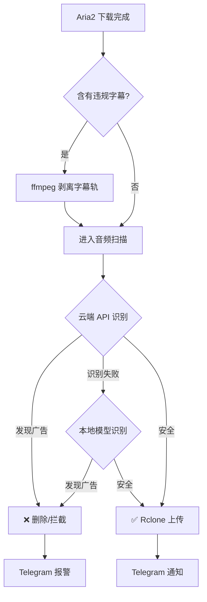

# 🛡️ Video-ASR-Ad-Cleaner

[](LICENSE)
[](https://www.python.org/)
[]()

**Video-ASR-Ad-Cleaner** 是一个基于 AI 语音识别的视频自动化清洗与审计工具。它专为 **Aria2 + Rclone** 流程设计，能够在文件上传到网盘之前，自动检测并拦截包含语音广告（如博彩、引流、加群信息）的视频文件，同时清洗元数据和违规字幕。

> **核心目标**：拒绝“脏”资源入库，打造纯净的影音库。

---

### ✨ 核心功能

* **🎙️ AI 音频双重审计**
    * **Cloud Mode**: 调用 SiliconFlow (SenseVoice) API 进行超高速云端识别。
    * **Local Fallback**: 云端超时或失败时，自动切换至本地模型 (**FunASR/Paraformer**)，无需联网也能精准拦截。
    * **智能切片**: 针对视频的“片头”、“中间”、“片尾”进行重点抽查，兼顾效率与准确率。
* **🧹 深度元数据清洗**
    * 自动擦除视频文件中的 Title、Comment、Artist 等元数据标签，移除类似 `www.xxx.com` 或 `公众号` 等引流信息。
* **📝 字幕广告拦截**
    * 扫描内封字幕流（ASS/SRT），检测到违规关键词（如“加Q群”、“澳门首家”）自动剥离该字幕轨，保留视频画面。
* **🚀 自动化工作流**
    * **Aria2 Hook**: 下载完成后自动触发。
    * **自动处置**: 检测通过 -> 调用 `rclone` 上传；检测不通过 -> 自动删除/重命名。
    * **Telegram 通知**: 实时推送扫描结果和拦截报告。
* **🖥️ 多平台支持**
    * 提供 Linux (服务器自动化) 和 Windows (桌面手动扫描) 版本。

---

### ⚙️ 工作流程




### 📦 环境依赖

安装 Python 依赖
```
pip install -r requirements.txt

#(主要依赖: funasr, modelscope, torch, pypinyin, thefuzz, requests)
```
安装系统工具 (Linux)

```Bash

sudo apt update
sudo apt install ffmpeg aria2 curl -y
```


1. 配置 Telegram Bot (必填)
```
export TG_BOT_TOKEN="your_bot_token_here"
export TG_CHAT_ID="your_chat_id_here"
```
2. Python 扫描脚本 (scan_audio.py / wincheck.py)
```
API_KEY = "sk-your-api-key-here" 
```

### 🚀 使用指南
场景 A: Aria2 自动化 (Linux)
在你的 aria2.conf 配置文件中添加 Hook：

```
# /root/.aria2/aria2.conf
on-download-complete=/root/Video-ASR-Ad-Cleaner/uppp.sh
```
重启 Aria2 后，所有下载完成的任务都会自动进入清洗和扫描流程。

场景 B: 手动批量扫描 (Linux)
如果你有一批存量文件需要检查：

```Bash

chmod +x manual_scan.sh
./manual_scan.sh /path/to/your/video_folder
```
场景 C: Windows 桌面版
双击运行或在终端执行 wincheck.py，支持拖入文件、文件夹或输入 HTTP 链接：

```Bash

python wincheck.py
```


### ❓ 常见问题 (FAQ)
Q: 第一次运行为什么下载很久？   
A: 首次运行时，脚本会自动从 ModelScope 下载 Paraformer 和 FSMN-VAD 模型（约 1GB），请保持网络畅通。后续运行会直接加载本地缓存。
<br><br>
Q: 日志里有很多进度条乱码？

A: 最新版本已通过上下文管理器屏蔽了底层库的进度条输出，请确保使用仓库中的最新代码。
<br><br>
Q: 没有 GPU 可以用吗？ 

A: 可以。Paraformer 模型对 CPU 推理进行了优化，虽然比 GPU 慢，但在服务器上处理几分钟的音频切片通常只需数秒。
<br><br>
### ⚖️ 免责声明
本项目仅供技术研究和个人学习使用，请勿用于非法用途~请遵守相关法律法规，尊重版权。
<hr>

###### 如果这个项目对你有帮助，请点个 Star ⭐️ 支持一下！~~