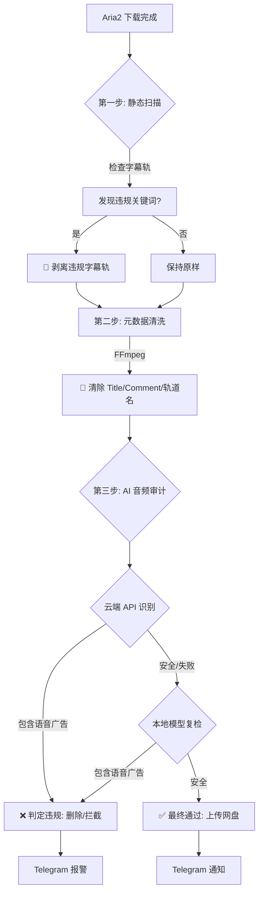

# 🛡️ Video-ASR-Ad-Cleaner

[](LICENSE)
[](https://www.python.org/)
[]()

**Video-ASR-Ad-Cleaner** 是一个基于 AI 语音识别的视频自动化清洗与审计工具。它专为 **Aria2 + Rclone** 流程设计，不仅能拦截包含语音广告的视频，还能**强力清除**视频文件内部的脏标签、广告元数据和违规轨道名称，确保入库 Emby/Plex 的文件绝对纯净。

> **核心目标**：拒绝“脏”资源入库，打造纯净的影音库。

---

## ✨ 核心功能

### 1. 🧼 强力元数据与轨道净化 (独家功能)
很多视频资源虽然画面干净，但元数据（Metadata）里塞满了广告，导致播放器显示异常。本工具能自动执行：
* **全局标签清洗**: 彻底移除 MP4/MKV 容器的 `Title` (标题)、`Comment` (注释)、`Artist` (作者)、`Description` 等全局元数据，**解决播放器顶部显示 "www.xxx.com" 的恶心问题**。
* **轨道名称清洗**: 深度扫描视频流、音频流、字幕流的 `title` 和 `handler_name`。如果轨道名称包含广告（如“某某资源网首发”），会自动将其抹除或重置为标准名称。

### 2. 🎙️ AI 音频双重审计
* **Cloud Mode**: 调用 SiliconFlow (SenseVoice) API 进行超高速云端识别。
* **Local Fallback**: 云端超时或失败时，自动切换至本地模型 (**FunASR/Paraformer**)，无需联网也能精准拦截。
* **智能切片**: 针对视频的“片头”、“中间”、“片尾”进行重点抽查，兼顾效率与准确率。

### 3. 📝 违规字幕拦截
* 扫描内封字幕流（ASS/SRT/SSA），检测到违规关键词（如“加Q群”、“澳门首家”、“发牌”）自动**剥离该字幕轨**，保留视频画面，去除牛皮癣。

### 4. 🚀 自动化工作流
* **Aria2 Hook**: 下载完成后自动触发。
* **自动处置**: 
    * ✅ 安全 -> 清洗元数据 -> Rclone 上传
    * ❌ 违规 (语音广告) -> 删除/拦截
* **Telegram 通知**: 实时推送扫描结果、拦截原因和清洗报告。

---

## ⚙️ 处理流程图


### 📦 环境依赖

安装 Python 依赖
```
pip install -r requirements.txt

#(主要依赖: funasr, modelscope, torch, pypinyin, thefuzz, requests)
```
安装系统工具 (Linux)

```Bash

sudo apt update
sudo apt install ffmpeg aria2 curl -y
```


1. 配置 Telegram Bot (必填)
```
export TG_BOT_TOKEN="your_bot_token_here"
export TG_CHAT_ID="your_chat_id_here"
```
2. Python 扫描脚本 (scan_audio.py / wincheck.py)
```
API_KEY = "sk-your-api-key-here" 
```

### 🚀 使用指南
场景 A: Aria2 自动化 (Linux)
在你的 aria2.conf 配置文件中添加 Hook：

```
# /root/.aria2/aria2.conf
on-download-complete=/root/Video-ASR-Ad-Cleaner/uppp.sh
```
重启 Aria2 后，所有下载完成的任务都会自动进入清洗和扫描流程。

场景 B: 手动批量扫描 (Linux)
如果你有一批存量文件需要检查：

```Bash

chmod +x manual_scan.sh
./manual_scan.sh /path/to/your/video_folder
```
场景 C: Windows 桌面版
双击运行或在终端执行 wincheck.py，支持拖入文件、文件夹或输入 HTTP 链接：

```Bash

python wincheck.py
```


### ❓ 常见问题 (FAQ)
Q: 第一次运行为什么下载很久？   
A: 首次运行时，脚本会自动从 ModelScope 下载 Paraformer 和 FSMN-VAD 模型（约 1GB），请保持网络畅通。后续运行会直接加载本地缓存。
<br><br>
Q: 日志里有很多进度条乱码？

A: 最新版本已通过上下文管理器屏蔽了底层库的进度条输出，请确保使用仓库中的最新代码。
<br><br>
Q: 没有 GPU 可以用吗？ 

A: 可以。Paraformer 模型对 CPU 推理进行了优化，虽然比 GPU 慢，但在服务器上处理几分钟的音频切片通常只需数秒。
<br><br>
### ⚖️ 免责声明
本项目仅供技术研究和个人学习使用，请勿用于非法用途~请遵守相关法律法规，尊重版权。
<hr>

###### 如果这个项目对你有帮助，请点个 Star ⭐️ 支持一下！~~