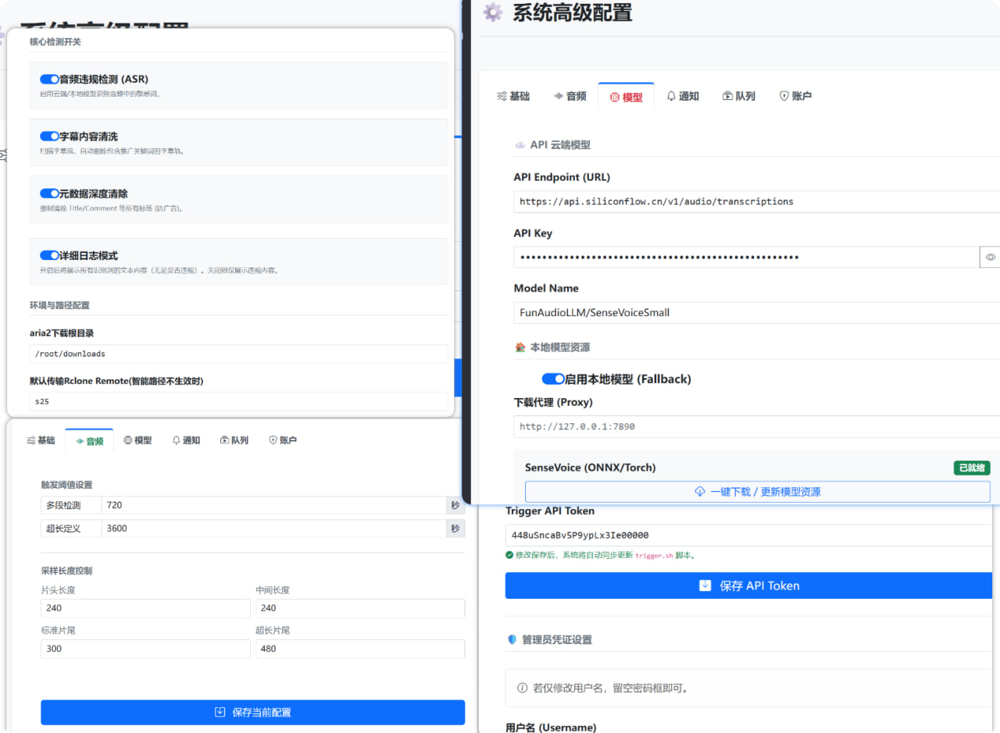
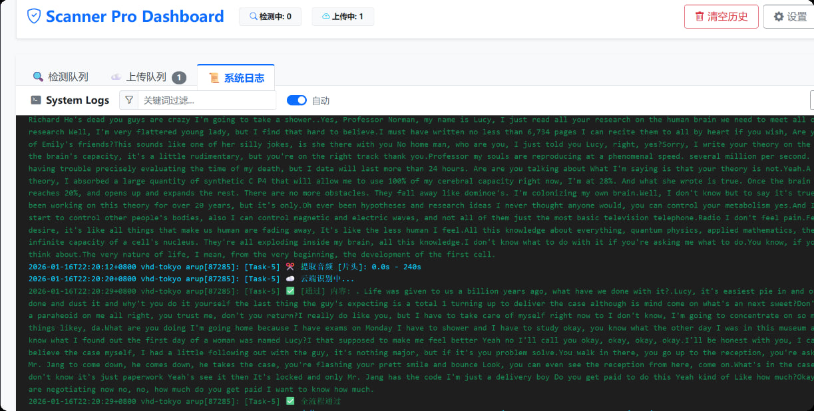

# 🛡️  Scanner Pro Dashboard

[](LICENSE)
[](https://www.python.org/)
[]()

** 基于 AI 语音识别的视频自动化清洗与审计工具。它专为 **Aria2 + Rclone** 流程设计，不仅能拦截包含语音广告的视频，还能**强力清除**视频文件内部的脏标签、广告元数据和违规轨道名称，确保入库 Emby/Plex 的文件绝对纯净。

> **核心目标**：拒绝“脏”资源入库，打造纯净的影音库。

---

## ✨ 核心功能

### 1. 🧼 强力元数据与轨道净化 
很多视频资源虽然画面干净，但元数据（Metadata）里塞满了广告，导致播放器显示异常。本工具能自动执行：
* **全局标签清洗**: 彻底移除 MP4/MKV 容器的 `Title` (标题)、`Comment` (注释)、`Artist` (作者)、`Description` 等全局元数据。
* **轨道名称清洗**: 深度扫描视频流、音频流、字幕流的 `title` 和 `handler_name`。如果轨道名称包含广告（如“某某资源网首发”），会自动将其抹除或重置为标准名称。

### 2. 🎙️ AI 音频双重审计
* **Cloud Mode**: 调用 SiliconFlow (SenseVoice) API 进行超高速云端识别。
* **Local Fallback**: 云端超时或失败时，自动切换至本地模型 (**FunASR/Paraformer**)，无需联网也能精准拦截。
* **智能切片**: 针对视频的“片头”、“中间”、“片尾”进行重点抽查，兼顾效率与准确率。

### 3. 📝 违规字幕拦截
* 扫描内封字幕流（ASS/SRT/SSA），检测到违规关键词自动**剥离该字幕轨**，保留视频画面，去除牛皮癣。

### 4. 🚀 自动化工作流
* **Aria2 Hook**: 下载完成后自动触发。
* **自动处置**: 
    * ✅ 安全 -> 清洗元数据 -> Rclone 上传
    * ❌ 违规 (语音广告) -> 删除/拦截
* **Telegram 通知**: 实时推送扫描结果、拦截原因和清洗报告。

---

## ⚙️ 界面预览



### 📦 安装部署
1.预先安装好rclone、aria2c

2.下载项目，安装脚本
```Shell
chmod +x install.sh  && ./install.sh
```
3.直接使用，或者修改nginx-server.conf反代


### ⚖️ 免责声明
本项目仅供技术研究和个人学习使用，请勿用于非法用途~请遵守相关法律法规，尊重版权。
<hr>

###### 如果这个项目对你有帮助，请点个 Star ⭐️ 支持一下！~~