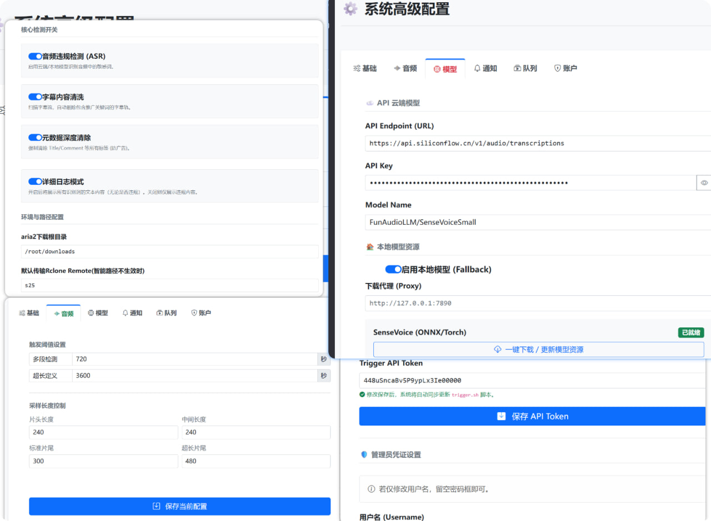
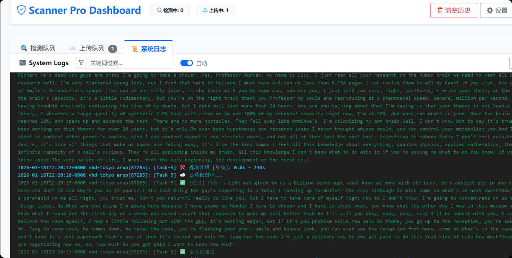

# 🛡️  Scanner Pro Dashboard

[](LICENSE)
[](https://www.python.org/)
[]()

** 基于 AI 语音识别的视频自动化清洗与审计工具。它专为 **Aria2 + Rclone** 流程设计，不仅能拦截包含语音广告的视频，还能**强力清除**视频文件内部的脏标签、广告元数据和违规轨道名称，确保入库 Emby/Plex 的文件绝对纯净。

> **核心目标**：拒绝“脏”资源入库，打造纯净的影音库。

---

## ✨ 核心功能

### 1. 🧼 强力元数据与轨道净化 
很多视频资源虽然画面干净，但元数据（Metadata）里塞满了广告，导致播放器显示异常。本工具能自动执行：
* **全局标签清洗**: 彻底移除 MP4/MKV 容器的 `Title` (标题)、`Comment` (注释)、`Artist` (作者)、`Description` 等全局元数据。
* **轨道名称清洗**: 深度扫描视频流、音频流、字幕流的 `title` 和 `handler_name`。如果轨道名称包含广告（如“某某资源网首发”），会自动将其抹除或重置为标准名称。

### 2. 🎙️ AI 音频双重审计
* **Cloud Mode**: 调用 SiliconFlow (SenseVoice) API 进行超高速云端识别。
* **Local Fallback**: 云端超时或失败时，自动切换至本地模型 (**FunASR/Paraformer**)，无需联网也能精准拦截。
* **智能切片**: 针对视频的“片头”、“中间”、“片尾”进行重点抽查，兼顾效率与准确率。

### 3. 📝 违规字幕拦截
* 扫描内封字幕流（ASS/SRT/SSA），检测到违规关键词自动**剥离该字幕轨**，保留视频画面，去除牛皮癣。

### 4. 🚀 自动化工作流
* **Aria2 Hook**: 下载完成后自动触发。
* **自动处置**: 
    * ✅ 安全 -> 清洗元数据 -> Rclone 上传
    * ❌ 违规 (语音广告) -> 删除/拦截
* **Telegram 通知**: 实时推送扫描结果、拦截原因和清洗报告。

---

## ⚙️ 界面预览



## 快速开始

### 安装
在 Linux VPS 上运行以下一行命令；无需预先下载项目 ZIP、安装 Aria2 或安装 rclone：
```Shell
sudo bash -c 'bash <(curl -fsSL https://raw.githubusercontent.com/jiemo9527/Video-ASR-Ad-Cleaner/main/install/install.sh)'
```
安装器会下载项目、安装依赖，初始化 Scanner 管理的 Aria2 配置，并进行网络与可选 Nginx HTTPS/WSS 配置。

### 首次登录
安装完成后，终端会一次性显示随机 Dashboard 用户名与密码。忘记密码时，在项目目录运行 `install/install.sh`，选择 `4. 重置 Dashboard 密码`；工具会生成并打印新的随机密码。

### 更新
再次运行安装命令后选择 `2. 更新`。更新模式会下载最新项目代码、更新依赖并重启 Scanner；保留数据库、`scanner.env`、Aria2 配置与 `rpc-secret`、Nginx、模型和 AriaNg 数据，不重新进入网络或 Nginx 配置。

### 基本配置
登录后进入 `设置`：

1. 在 `基础` 中确认 Aria2 下载根目录与默认 Rclone Remote。
2. 在 `模型` 中配置云端 ASR API，或下载 SenseVoice GGUF 本地模型。
3. 在右侧维护音频、字幕和元数据关键词；关键词会影响后续扫描任务。
4. 保存设置。检测与上传并发数修改后，需要使用 `保存并重启服务`。

### 下载与清洗

1. 在 Dashboard `下载器` 标签中添加下载任务。嵌入 AriaNg 自动连接本机 Aria2，不能改为远程 RPC。
2. Aria2 下载完成后，通过 `trigger.sh` 将文件加入 Scanner 队列。使用自定义 Aria2 配置时，请自行设置 `on-download-complete=<项目目录>/trigger.sh`。
3. Scanner 按设置检查元数据、字幕和音频；干净文件进入上传队列，命中关键词的文件标记为违规。
4. 外部 Aria2 客户端使用 `https://<域名>/jsonrpc` 或 `wss://<域名>/jsonrpc`，并自行配置安装时显示的 `rpc-secret`。

### 配置备份与恢复
`设置` -> `账户` 中可导出或恢复备份。备份包含全局设置和关键词，且含 API Key、通知 Token 等敏感项；不包含 Aria2 配置、下载任务、AriaNg 浏览器设置和账户密码。迁移服务器时，先导出备份，重新安装后再恢复。


### ⚖️ 免责声明
本项目仅供技术研究和个人学习使用，请勿用于非法用途~请遵守相关法律法规，尊重版权。
<hr>

###### 如果这个项目对你有帮助，请点个 Star ⭐️ 支持一下！~~
