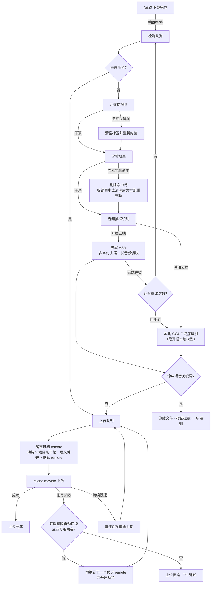
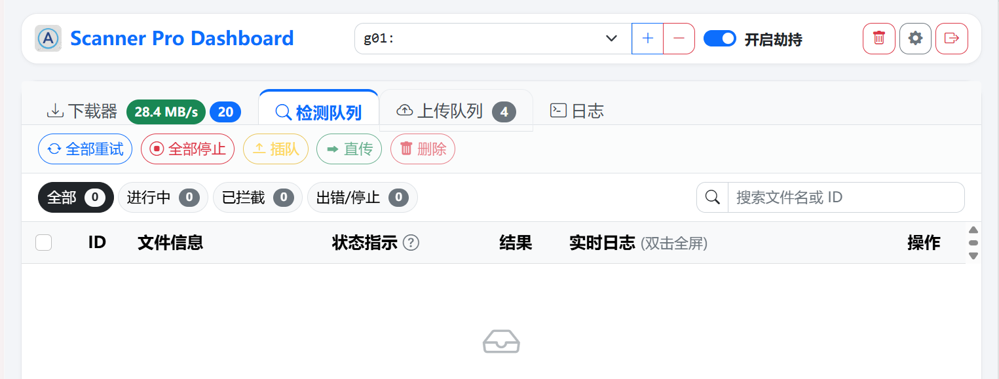
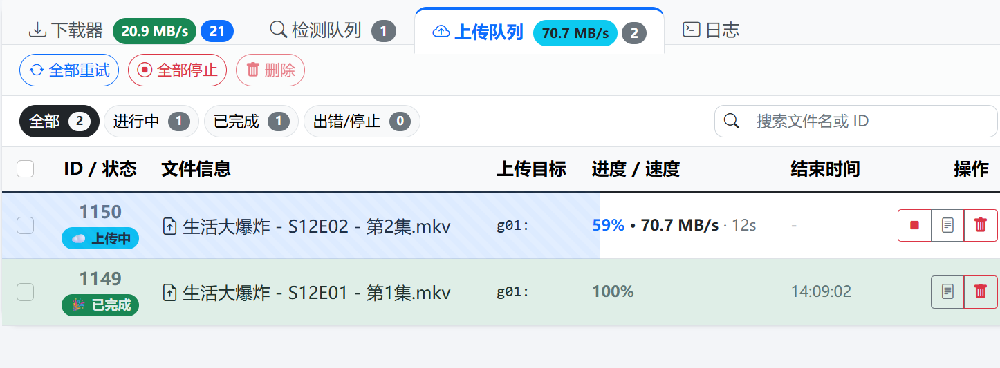
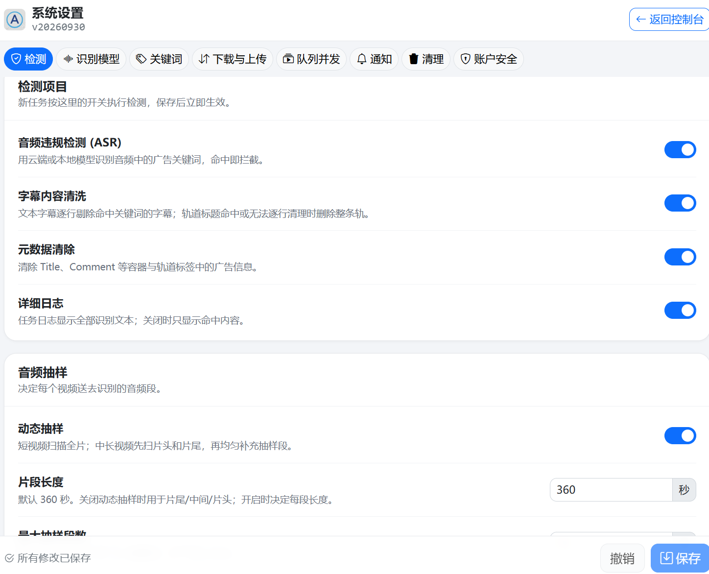
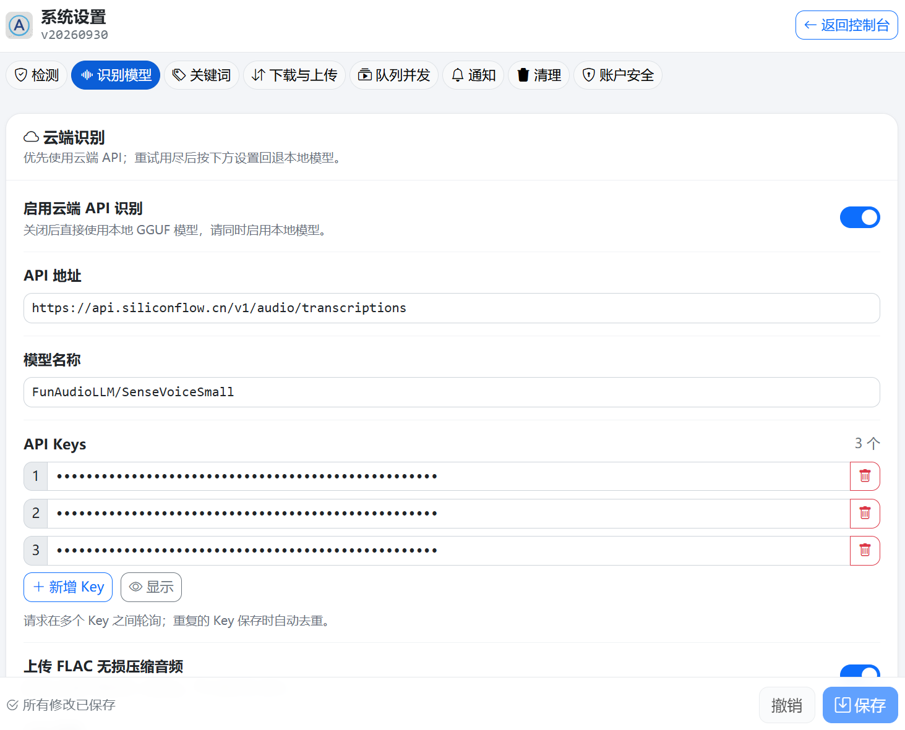

# 🛡️  Scanner Pro Dashboard

[](LICENSE)
[](https://www.python.org/)
[]()

基于 AI 语音识别的视频自动化清洗与审计工具。专为 **Aria2 + Rclone** 流程设计：下载完成后自动检查元数据、字幕和音频，拦截含语音广告的视频，清除文件内的广告元数据和字幕，再上传到网盘，保证入库 Emby/Plex 的文件干净。

> **核心目标**：拒绝“脏”资源入库，打造纯净的影音库。

---

## ✨ 核心功能

### 1. 🧼 元数据净化
* 扫描容器全局标签（`title`、`comment`、`description` 等）以及视频、音频、字幕轨的 `title` / `handler_name`，命中元数据关键词时重新封装并清空这些标签，不重新编码。
* 匹配前去除零宽字符，防止广告文字用零宽字符拆开逃过检测。
* 重新封装时自动跳过 ffmpeg 无法识别的音频流（如 `av3a`），避免 MP4 封装失败。

### 2. 📝 字幕行级清洗
* 一次 ffmpeg 批量导出全部内封文本字幕（ASS/SSA/SRT/WebVTT/mov_text），多语言文件几十条字幕轨也只需十几秒。
* 命中关键词时只**剔除命中的那一行字幕**，其余字幕、时间轴和轨道语言、标题、默认标记保持不变。
* 轨道标题等元数据命中，或剔除后字幕为空时，才**剥离整条字幕轨**。
* 图片字幕（PGS/VobSub 等）不做 OCR，只检查轨道元数据。

### 3. 🎙️ AI 语音审计
* **云端识别**：调用 SiliconFlow (SenseVoice) 等兼容接口。支持多个 API Key 轮询、全局与单 Key 并发上限、长音频切块（默认每块 ≤60s）、可选上传代理。
* **本地兜底**：云端重试用尽或关闭云端识别时，切换至本地 **SenseVoice GGUF (llama.cpp)** 模型，设置页一键下载，可限制本地推理并发。
* **动态抽样**：按时长自动规划片头、片尾和中间抽样段，短片整片识别；同一任务的多个抽样段并发识别。
* **断点续检**：已通过的抽样段会记录下来，重试时只识别失败或未完成的段，并复用已提取的音频。

### 4. ☁️ 上传与远端劫持
* 干净文件通过 `rclone moveto` 上传。下载根目录下的第一层文件夹名就是目标 remote（如 `downloads/g01/Season 3/a.mkv` → `g01:a.mkv`，中间子文件夹丢弃）；根目录下的文件用默认 remote；多文件任务保留任务自身的目录结构。
* **远端劫持**：顶部维护候选 remote 下拉框，开启后新进入上传队列的任务改传到选定 remote。
* **超限自动切换**（可选）：账号触发上传或空间上限时，自动换下一个候选 remote 并开启劫持，重新上传不占用重试次数。
* **低速自动重连**：大文件持续低速时自动重启上传连接。

### 5. 📥 内置下载器
* Dashboard 内嵌 AriaNg，通过 Scanner 鉴权代理连接本机 Aria2，浏览器端不暴露 `rpc-secret`。
* 可选通过 Nginx 暴露 `wss://<域名>/jsonrpc`，供外部 Aria2 客户端使用。
* 可自动丢弃图片、NFO 及自定义扩展名的单文件下载。

### 6. 🖥️ 队列管理面板
* 检测和上传两个队列，支持按状态筛选、搜索、多选批量操作：重试、插队、直传（跳过检测）、停止、删除（运行中的任务先停止再删除）。
* 失败自动重试，重试任务优先于新任务执行；服务重启后未完成任务自动恢复排队。
* 适配手机：紧凑列表、顶部总下载/上传速度。
* 快捷键：队列页或下载器页连按两次空格，清空设置中已启用的历史记录。

### 7. 🚀 自动化工作流
* **Aria2 Hook**：下载完成后由 `trigger.sh` 自动加入检测队列。
* **自动处置**：
    * ✅ 干净 → 清洗元数据和字幕 → Rclone 上传
    * ❌ 语音命中关键词 → 删除文件并标记拦截
* **Telegram 通知**：推送拦截、失败和上传成功（可选）消息。
* **状态探针**：`GET /api/status`（`X-API-Token` 鉴权）返回忙碌/空闲状态，便于多服务器编排。

---

## 🔄 工作流程


```mermaid
flowchart TD
    A["Aria2 下载完成"] -->|trigger.sh| B["检测队列"]
    B --> C{"直传任务?"}
    C -->|是| U["上传队列"]
    C -->|否| D["元数据检查"]
    D -->|命中关键词| D1["清空标签并重新封装"]
    D -->|干净| E["字幕检查"]
    D1 --> E
    E -->|文本字幕命中| E1["剔除命中行<br/>标题命中或清洗后为空则删整轨"]
    E -->|干净| F["音频抽样识别"]
    E1 --> F
    F -->|开启云端| G["云端 ASR<br/>多 Key 并发 · 长音频切块"]
    G -->|云端失败| R{"还有重试次数?"}
    R -->|有| B
    R -->|已用尽| L["本地 GGUF 兜底识别<br/>（需开启本地模型）"]
    F -->|关闭云端| L
    G --> H{"命中语音关键词?"}
    L --> H
    H -->|是| X["删除文件 · 标记拦截 · TG 通知"]
    H -->|否| U
    U --> T["确定目标 remote<br/>劫持 > 根目录下第一层文件夹 > 默认 remote"]
    T --> M["rclone moveto 上传"]
    M -->|成功| OK["上传完成"]
    M -->|账号超限| S{"开启超限自动切换<br/>且有可用候选?"}
    S -->|是| S1["切换到下一个候选 remote<br/>并开启劫持"]
    S1 --> U
    S -->|否| ERR["上传出错 · TG 通知"]
    M -->|持续低速| W["重建连接重新上传"]
    W --> U
```

---

## ⚙️ 界面预览

**检测队列**



**上传队列**



**设置 · 检测**



**设置 · 识别模型**



## 快速开始

### 安装
在 Linux VPS 上运行以下一行命令；无需预先下载项目 ZIP、安装 Aria2 或安装 rclone：
```Shell
sudo bash -c 'bash <(curl -fsSL https://raw.githubusercontent.com/jiemo9527/Video-ASR-Ad-Cleaner/main/install/install.sh)'
```
安装器会下载项目、安装依赖，初始化 Scanner 管理的 Aria2 配置，并进行网络与可选 Nginx HTTPS/WSS 配置。

### 首次登录
安装完成后，终端会一次性显示随机 Dashboard 用户名与密码。忘记密码时，在项目目录运行 `install/install.sh`，选择 `4. 重置 Dashboard 密码`；工具会生成并打印新的随机密码。

### 更新
再次运行安装命令后选择 `2. 更新`。更新模式会下载最新项目代码、更新依赖并重启 Scanner；保留数据库、`scanner.env`、Aria2 配置与 `rpc-secret`、Nginx、模型和 AriaNg 数据，不重新进入网络或 Nginx 配置。

### 基本配置
登录后进入 `设置`：

1. `下载与上传`：确认 Aria2 下载根目录与默认 Rclone Remote，按需开启超限自动切换、低速自动重连和图片/NFO 丢弃。
2. `识别模型`：配置云端 ASR API 与 Key，或下载 SenseVoice GGUF 本地模型。
3. `关键词`：维护音频、字幕和元数据关键词；关键词即时保存，影响后续扫描任务。
4. `检测`：选择要执行的检查项（元数据、字幕、音频）和抽样参数。
5. 点击底部保存栏保存。修改检测或上传并发数后，保存栏会变为 `保存并重启`。

### 下载与清洗

1. 在 Dashboard `下载器` 标签中添加下载任务。嵌入的 AriaNg 自动连接本机 Aria2，不能改为远程 RPC。
2. Aria2 下载完成后，通过 `trigger.sh` 将文件加入 Scanner 队列。项目不在默认目录 `/www/wwwroot/scanner_web` 或使用自定义 Aria2 配置时，请确认 `on-download-complete=<项目目录>/trigger.sh`。
3. 想上传到某个 remote，就把文件下载到 `<下载根目录>/<remote 名>/` 下。
4. Scanner 按设置检查元数据、字幕和音频；干净文件进入上传队列，语音命中关键词的文件被拦截。
5. 外部 Aria2 客户端使用 `https://<域名>/jsonrpc` 或 `wss://<域名>/jsonrpc`，并自行配置安装时显示的 `rpc-secret`。

### 配置备份与恢复
`设置` -> `账户安全` 中可导出或恢复备份。备份包含全局设置和关键词，且含 API Key、通知 Token 等敏感项；不包含 Aria2 配置、下载任务、AriaNg 浏览器设置和账户密码。AriaNg 浏览器设置可在 `下载器` 标签中单独导入/导出。迁移服务器时，先导出备份，重新安装后再恢复。


### ⚖️ 免责声明
本项目仅供技术研究和个人学习使用，请勿用于非法用途~请遵守相关法律法规，尊重版权。
<hr>

###### 如果这个项目对你有帮助，请点个 Star ⭐️ 支持一下！~~
